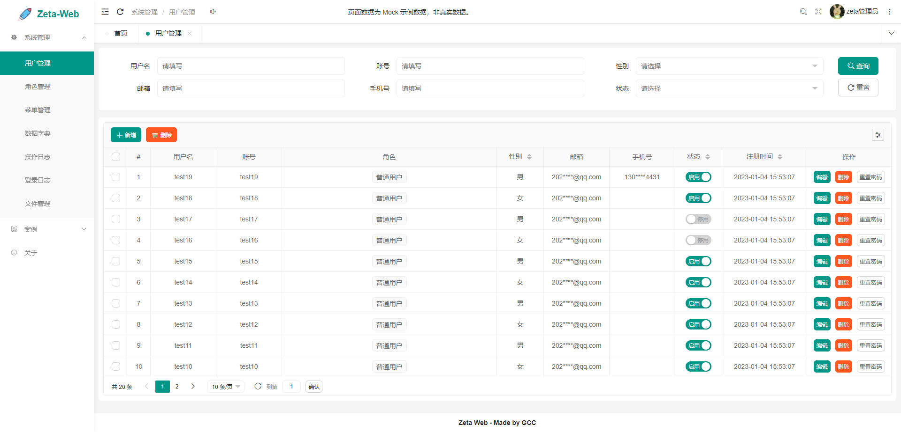
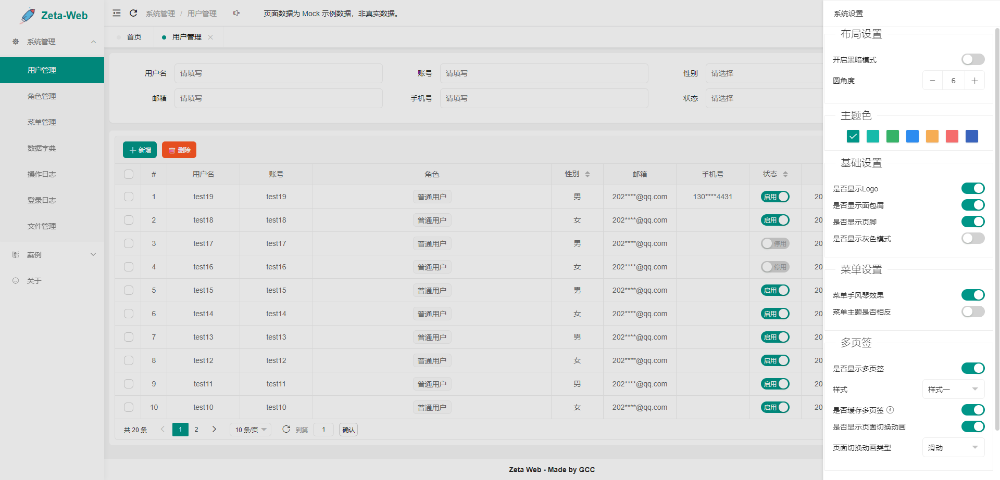
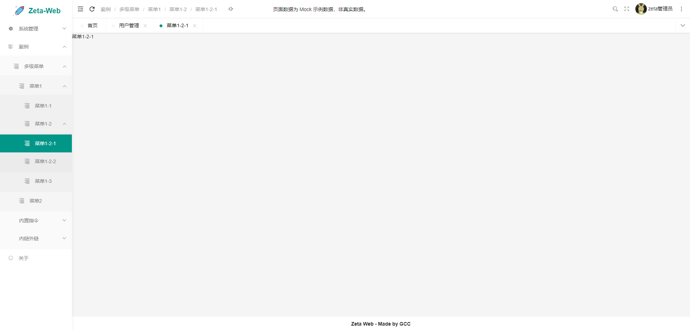
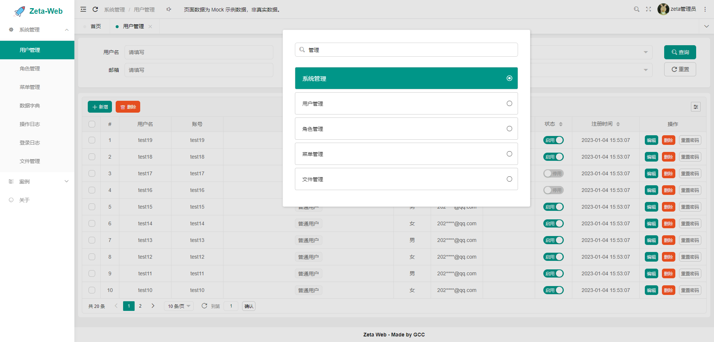
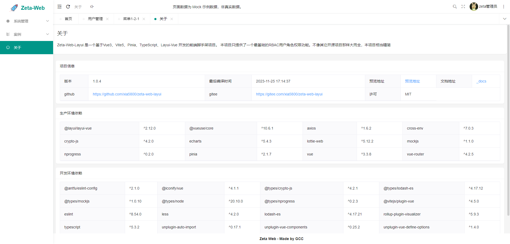

# Layui Vue Admin

## 📚 项目概述

Layui Vue Admin 是一个基于 Vue 3 + Layui Vue 构建的现代化前端管理系统模板，提供了丰富的组件和功能，适合快速构建企业级管理后台。

- 基于 Vue 3 + TypeScript + Vite 构建
- 集成 Layui Vue 组件库
- 完善的权限管理系统
- 丰富的页面模板和组件示例
- 响应式设计，支持多端适配

## ✨ 项目特点

- **现代化技术栈**：Vue 3 + TypeScript + Vite
- **丰富的组件**：集成 Layui Vue 组件库，提供大量现成组件
- **完整的权限系统**：基于路由和指令的权限控制
- **多布局支持**：管理员、文档、网站三种布局模式
- **国际化支持**：内置中英文语言切换
- **Mock 数据**：提供完整的模拟数据，方便开发测试
- **代码规范**：TypeScript 类型检查，确保代码质量

## 🛠️ 技术栈

| 技术 | 版本 | 说明 |
|------|------|------|
| Vue | 3.5.27 | 前端框架 |
| TypeScript | 5.7.2 | 类型系统 |
| Vite | 5.4.21 | 构建工具 |
| Layui Vue | 2.21.1 | UI 组件库 |
| Vue Router | 4.2.5 | 路由管理 |
| Pinia | 2.1.7 | 状态管理 |
| Axios | 1.5.1 | HTTP 客户端 |
| ECharts | 5.4.3 | 数据可视化 |
| Markdown-it | 14.1.0 | Markdown 解析 |

## 🚀 快速开始

### 环境要求

- Node.js >= 16.0.0
- pnpm >= 8.0.0

### 安装步骤

1. **克隆项目**

```bash
git clone https://github.com/Liwncy/GithubIo.git
cd GithubIo
```

2. **切换 Node.js 版本**

```bash
# 安装指定版本
nvm install 16.0.0
# 使用指定版本
nvm use 16.0.0
```

3. **安装 pnpm**

```bash
npm install -g pnpm
```

4. **安装依赖**

```bash
pnpm install
```

5. **启动开发服务器**

```bash
npm run dev
```

6. **构建项目**

```bash
# 开发环境构建
npm run build

# 生产环境构建（包含类型检查）
npm run build:prod
```

## 📁 项目结构

```
├── _docs/            # 项目文档和截图
├── mock/             # 模拟数据
├── plugin/           # 自定义插件
├── public/           # 静态资源
├── src/              # 源代码
│   ├── api/          # API 接口
│   ├── assets/       # 资源文件
│   ├── components/   # 公共组件
│   ├── config/       # 配置文件
│   ├── directives/   # 自定义指令
│   ├── document/     # 文档内容
│   ├── enums/        # 枚举类型
│   ├── lang/         # 国际化文件
│   ├── layouts/      # 布局组件
│   ├── router/       # 路由配置
│   ├── store/        # 状态管理
│   ├── types/        # 类型定义
│   ├── utils/        # 工具函数
│   ├── views/        # 页面组件
│   ├── App.vue       # 根组件
│   └── main.ts       # 入口文件
├── .env              # 环境变量
├── .env.development  # 开发环境变量
├── .env.production   # 生产环境变量
├── index.html        # HTML 模板
├── package.json      # 项目配置
└── README.md         # 项目说明
```

## 🎯 核心功能

### 1. 权限管理

- 基于路由的权限控制
- 基于指令的按钮权限
- 动态路由生成

### 2. 布局系统

- 管理员布局：左侧菜单 + 顶部导航 + 标签页
- 文档布局：左侧目录 + 右侧内容
- 网站布局：通用网站布局

### 3. 组件库

- 基础组件：按钮、表单、表格等
- 高级组件：树形选择、级联选择、富文本等
- 业务组件：登录、注册、用户管理等

### 4. 工具函数

- 请求封装
- 加密解密
- 缓存管理
- 树结构处理

### 5. 国际化

- 内置中英文支持
- 可扩展多语言

## 📷 预览截图

### 登录页面


### 用户管理页面


### 系统设置


### 多级菜单


### 菜单搜索


### 关于页面


## 🔒 安全说明

### 加密过程
- 接口 API 请求：MD5(方法名+"_"+admin_pwd)
- 参数请求路径：Md5 加密
- 请求携带（解密用）：加密请求路径 Base64
- 数据加密：Base64(Base64(数据)和<参数请求路径 Md5 加密>找地方随便扔)

## 📖 开发文档

项目包含详细的开发文档，位于 `_docs` 目录：

- [项目结构](_docs/01.项目结构.md)
- [项目配置](_docs/02.项目配置.md)
- [登录流程](_docs/03.登录流程.md)
- [菜单路由](_docs/04.菜单路由.md)
- [打包部署](_docs/05.打包部署.md)
- [常见问题及解决方法](_docs/常见问题及解决方法.md)

## 🤝 贡献指南

1. Fork 本仓库
2. 创建特性分支 (`git checkout -b feature/AmazingFeature`)
3. 提交更改 (`git commit -m 'Add some AmazingFeature'`)
4. 推送到分支 (`git push origin feature/AmazingFeature`)
5. 打开 Pull Request

## 📄 许可证

本项目采用 MIT 许可证 - 详情请参阅 [LICENSE](LICENSE) 文件

## 📞 联系方式

- 项目地址：https://github.com/Liwncy/GithubIo

---

**如果觉得本项目有帮助，请给个 ⭐️ 支持一下！**